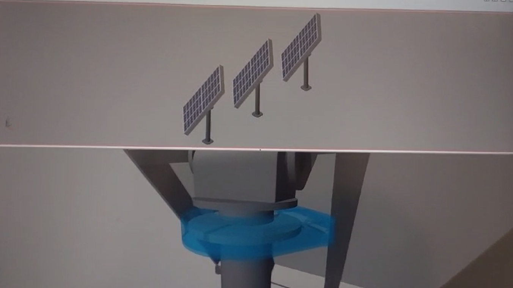

# Solar-Tracker-Control-Simulation

## Description
This is a design and implementation of a controller to control the axis of a solar tracker system to optimize the angle of incidence between solar panels and sunlight for maximum energy absorption. The foundational element for this project is the ***"Using the Worm and Gear Constraint Block - Solar Tracker"*** example from ***Simscape™ Multibody™***. It is a simulation-based control system that manages the movement of at least one mechanical axis of a solar panel system, to track the sun's path across the sky accurately. The decision on which axis to prioritize and implement first in a solar tracking system is based on maximizing solar energy capture, which is influenced by the path of the sun relative to the location of the solar panels. For example, the sun's elevation in equatorial regions does not vary as much throughout the year, so a ***single-axis azimuth tracker*** might be sufficient. Conversely, in higher latitudes, the elevation axis might be more critical due to the significant variation in the sun's altitude with the seasons. Therefore, the design of the solar tracking system is tailored to the installation's specific geographic location and the solar panels' orientation. Here's a brief overview of the typical functions of each axis in a solar tracking system:

- ***Azimuth Axis***: This axis allows the solar tracker to rotate horizontally. The movement along this axis aligns the solar panels with the sun's position from east to west throughout the day. Control of the azimuth axis is essential for following the sun's apparent motion across the sky, which is primarily due to the Earth's rotation.
- ***Elevation (Altitude) Axis***: The elevation axis enables vertical movement of the solar panels. Adjustments along this axis change the tilt of the panels to match the sun's elevation in the sky, which varies with the time of day and seasons.

## Project Implementation

We used the solar tracker model of "Using the Worm and Gear Constraint Block - Solar Tracker" example from Simscape™ Multibody™. The model takes latitude, longitude, and the current time as its input and updates the position of the solar panel.

#### Worm and Gear Constraint Block - Solar Tracker

### Control System Design:

To effectively manage the solar tracker, integrating control systems such as ***PID controllers*** is crucial. These controllers adjust the yaw and pitch angles of the solar panels to ensure they are always optimally oriented toward the sun. The PID controllers take the difference between the desired and actual angles and adjust the motor voltage accordingly to minimize this difference, thereby optimizing the solar panel's orientation and maximizing energy capture.

### Implementing MATLAB Functions for Solar Position Calculation:

A MATLAB function calculates the yaw and pitch angles required for the solar tracker. This function utilizes the Solar Position Algorithm (SPA) to compute the ***solar azimuth and zenith angles*** based on ***geographic location*** and ***time***. The calculated angles are then used as inputs to the PID controllers, ensuring that the solar panels accurately align with the sun's position throughout the day.

### Solar Irradiance Data 

Before running the Simulink model load the solardata.mata file into the base workspace. This file contains the solar irradiance data at a place recorded at an interval of every two minutes. A MATLAB function is implemented to convert the current time vector into the index to access the solar irradiance data from the file. 

### Stateflow Algorithm for Energy Optimization: ###

A Stateflow chart is implemented to manage the solar tracker’s operational modes: Daytime Mode, Night-time Mode, and Cloudy Mode. In ***Daytime Mode***, the system continuously adjusts to follow the sun. In ***Night-time Mode***, the tracker moves to a default position to minimize wear and tear. During ***Cloudy Mode***, the tracker holds its current position to save energy, as precise tracking is less critical. These modes are controlled by state transitions based on real-time inputs such as sunlight intensity and time of day, ensuring the system adapts dynamically to varying conditions.

### Maximum Power Point Tracking (MPPT) Algorithm: ###

To optimize the energy output of the solar panels, an MPPT algorithm is integrated into the system. The ***MPPT algorithm*** continuously adjusts the electrical operating point of the modules to ensure they operate at their maximum power point. This is crucial for extracting the maximum possible energy from the solar panels under varying environmental conditions, thereby enhancing the overall efficiency of the solar tracker system.
For a practical demonstration of the Maximum Power Point Tracking (MPPT) algorithm using the Perturb and Observe method, check out this interactive demo provided by MathWorks:
[MPPT Perturb & Observe Interactive Demo](https://in.mathworks.com/matlabcentral/fileexchange/72796-mppt-perturb-observe-interactive-demo?s_tid=srchtitle_support_results_2_mppt%2520function).
This provides a hands-on experience to understand the workings and benefits of the MPPT algorithm in photovoltaic systems.

**Battery Energy Storage System (BESS)**:

 This system is designed to integrate a solar PV system with a ***battery energy storage system (BESS)*** to optimize energy usage and improve system resilience. The main components of the system include a photovoltaic (PV) array, a battery, and control algorithms for charging and discharging the battery based on the PV power generation, load demand, and the state of charge (SoC) of the battery.
## Contributors
- Kshitij Amarnath Shetty, Mechanical Engineering Dept., IIT Indore
- Kaustuv Devmishra, Mechanical Engineering Dept., IIT Indore
- Krishan Swami, Mechanical Engineering Dept., IIT Indore
- Mihir Hemani, Mechanical Engineering Dept., IIT Indore
  
